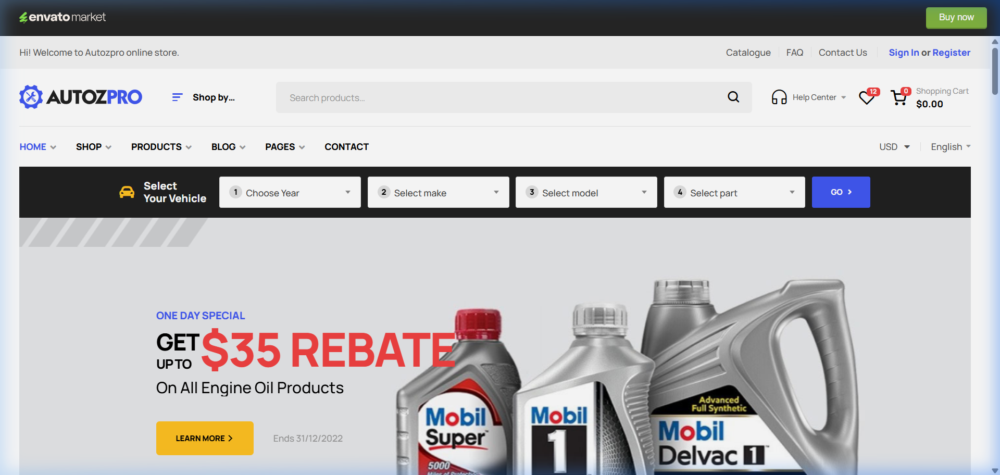
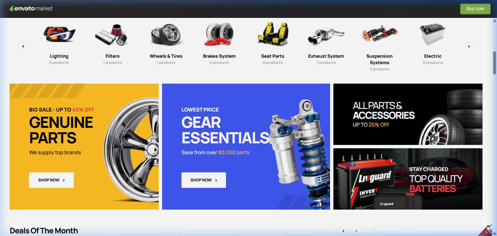
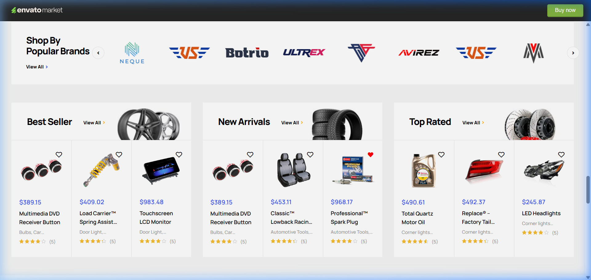
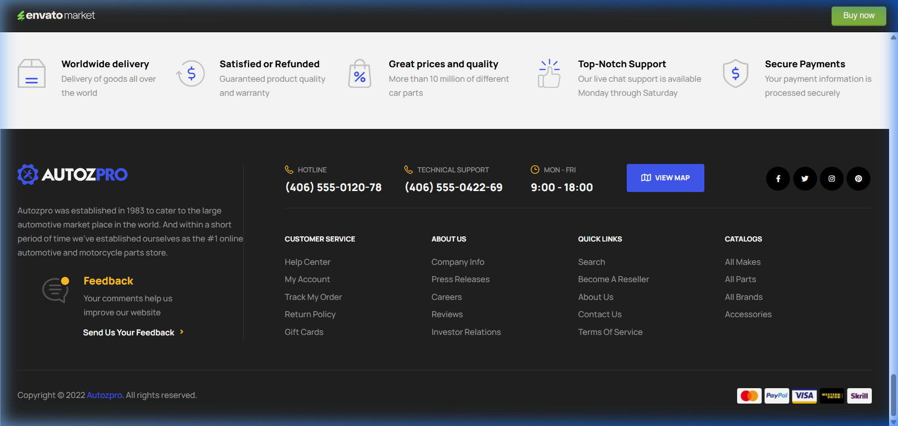
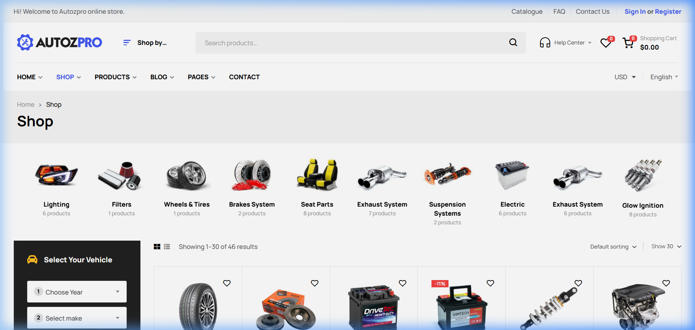
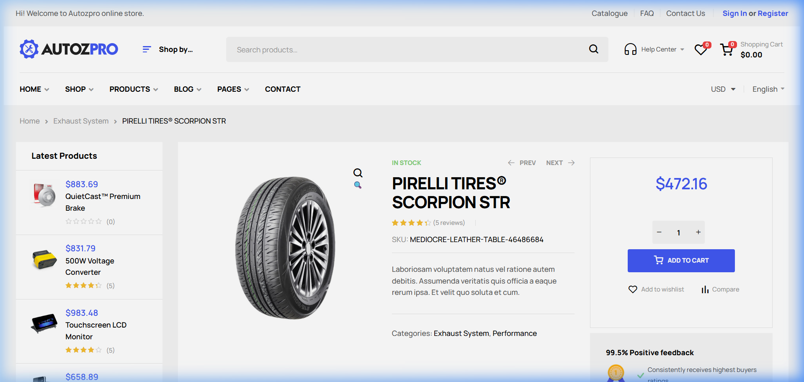
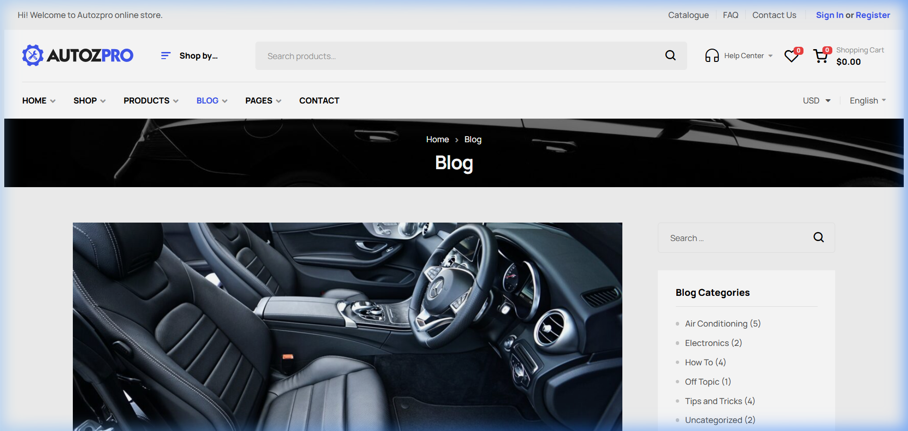
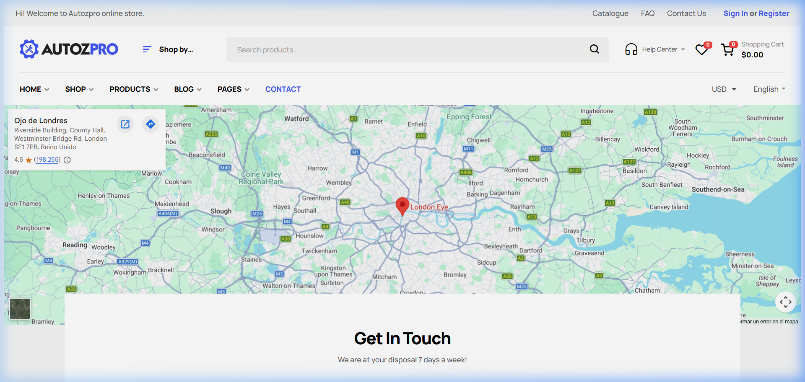
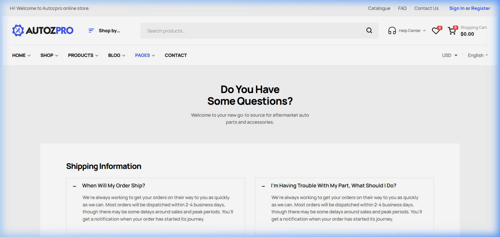
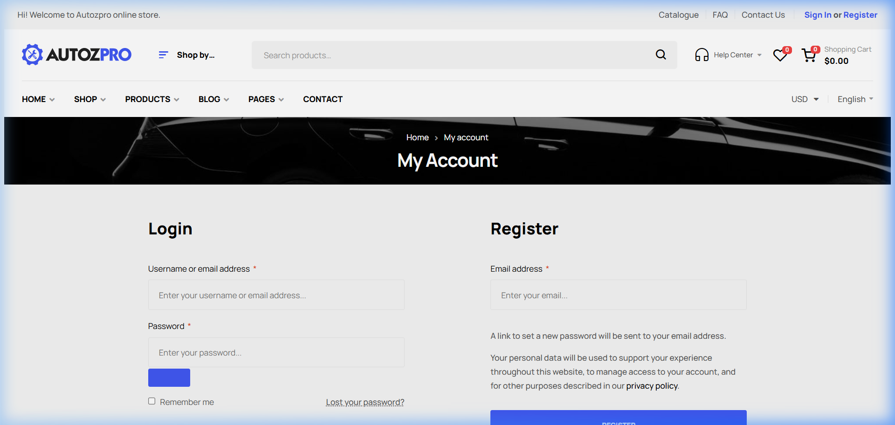

# Auditoría de Diseño: Autozpro Auto Parts (Copia de Proyecto)

Este documento es una guía estética y funcional basada en la plantilla **Autozpro**.

## 1. Experiencia de Búsqueda Centrada en el Vehículo

## 2. Identidad Visual y Categorización Premium

## 3. Cards de Producto Optimizadas

## 4. Footer y Confianza (Trust Signals)

---

## 5. Tienda (Shop) y Filtrado Inteligente

## 6. Ficha de Producto: Optimización de Conversión

## 7. Blog y Educación Técnica

## 8. Página de Contacto y Soporte

---

## 9. Sobre Nosotros (About Us): Construcción de Autoridad

---

## 10. Páginas Legales e Informativas

---

### Conclusiones para Imbra
1.  **Prioridad:** Mapear la lógica de "Marca/Modelo" de SAP para habilitar el selector de vehículos.
2.  **Aesthetics:** Adoptar un sistema de iconos 3D para las categorías principales.
3.  **UX:** Mantener el navbar sticky con el buscador siempre visible.
