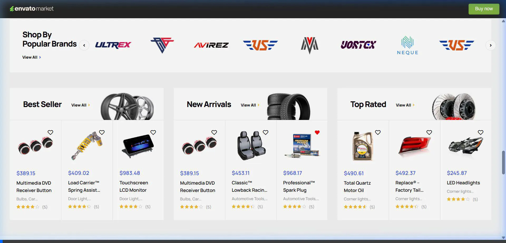
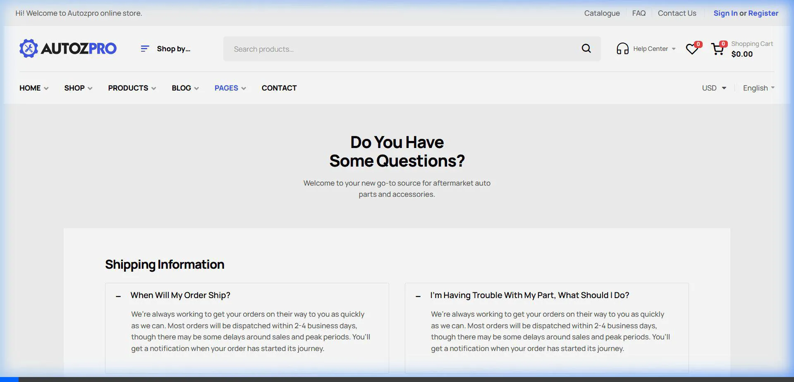

# Walkthrough: Auditoría de Diseño Autozpro para Imbra Store

Este documento resume el proceso de auditoría realizado sobre el tema **Autozpro**, integrando análisis de UX, UI y Arquitectura de Información.

## 1. Conversión y UX Técnica

### Búsqueda de Repuestos (Home)


### Tienda y Ficha Técnica
````carousel

<!-- slide -->

````

## 2. Autoridad de Marca y Contenido (Sobre Nosotros)
````carousel

<!-- slide -->

<!-- slide -->

````

## 3. Estructura de Soporte y Legales


## 4. Grabaciones de la Auditoría
Puedes ver el recorrido interactivo en estos archivos:

````carousel

<!-- slide -->

<!-- slide -->

````

---
**Nota:** Todos los archivos de medios se encuentran en la subcarpeta `imagenes/` dentro del directorio de auditoría del proyecto.
