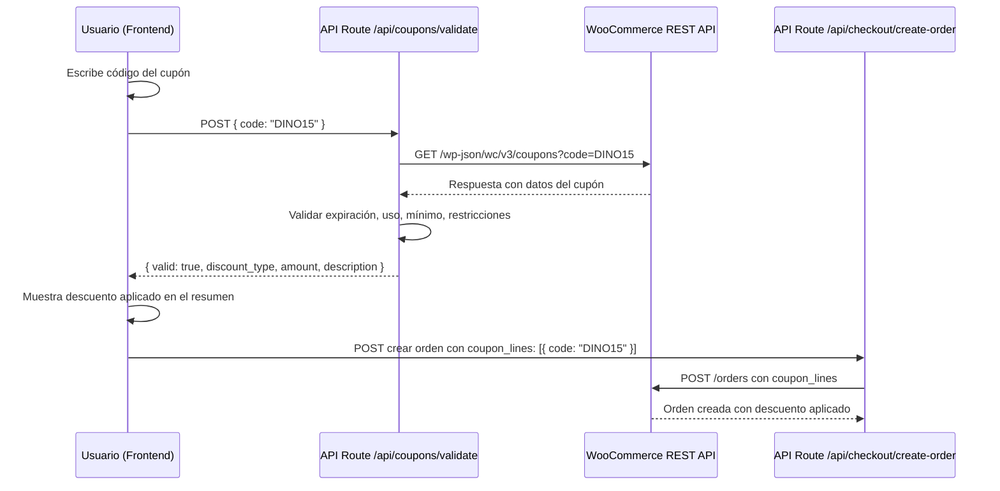

# Sistema de Cupones WooCommerce en Checkout Headless

## Contexto

El cliente Imbra Store tiene cupones configurados en WooCommerce (ejemplo: `DINO15` — descuento fijo de $15.000 COP en el carrito, fecha de caducidad 2026-06-30). Actualmente el checkout headless **no tiene ningún campo para ingresar cupones**, ni lógica para validarlos o aplicarlos a la orden.

### Lo que existe hoy en WooCommerce
| Campo | Valor del cupón `DINO15` |
|---|---|
| Tipo de descuento | Descuento fijo en el carrito |
| Importe | $15.000 COP |
| Fecha de caducidad | 2026-06-30 |
| Uso/Límite | 0 / Ilimitado |
| IDs de Producto (restricción) | Sin restricción |

## Arquitectura del Flujo Propuesto



## Propuesta de Cambios

### Componente 1: API Route de Validación de Cupones

#### [NUEVO] [route.ts](file:///f:/CLIENTES/IMBRA-MAPACHE/Imbra%20Store/src/app/api/coupons/validate/route.ts)

Endpoint `POST /api/coupons/validate` que:
1. Recibe `{ code: string }` del frontend.
2. Llama a la REST API de WooCommerce: `GET /wp-json/wc/v3/coupons?code=CODIGO`.
3. Valida del lado del servidor:
   - **Existencia**: Si el array viene vacío, el cupón no existe.
   - **Expiración** (`date_expires`): Comparar contra la fecha actual UTC.
   - **Límite de uso** (`usage_limit` vs `usage_count`): Si ya se agotó.
   - **Monto mínimo** (`minimum_amount`): Comparar contra el subtotal del carrito (se envía desde frontend).
   - **Restricciones de producto** (`product_ids`, `excluded_product_ids`): Validación básica.
4. Devuelve al frontend:
   ```json
   {
     "valid": true,
     "code": "DINO15",
     "discount_type": "fixed_cart",
     "amount": "15000",
     "description": "Edwin Dinamometro",
     "free_shipping": false,
     "date_expires": "2026-06-30T00:00:00",
     "minimum_amount": "0",
     "maximum_amount": "0"
   }
   ```
   O en caso de error:
   ```json
   {
     "valid": false,
     "error": "Este cupón ha expirado."
   }
   ```

> [!IMPORTANT]
> La validación se hace del lado del servidor para que nadie pueda manipular cupones desde el DevTools del navegador. Las claves de WooCommerce nunca se exponen al cliente.

---

### Componente 2: Estado del Cupón en el Checkout (CartContext o local)

#### [MODIFICAR] [CheckoutForm.tsx](file:///f:/CLIENTES/IMBRA-MAPACHE/Imbra%20Store/src/components/checkout/CheckoutForm.tsx)

Se agrega estado local en el `CheckoutForm` (no en el CartContext global, porque el cupón solo aplica durante el checkout):

```typescript
// Estado del cupón
const [couponCode, setCouponCode] = useState('');
const [couponLoading, setCouponLoading] = useState(false);
const [appliedCoupon, setAppliedCoupon] = useState<{
  code: string;
  discount_type: 'fixed_cart' | 'percent' | 'fixed_product';
  amount: number;
  description: string;
  free_shipping: boolean;
} | null>(null);
const [couponError, setCouponError] = useState<string | null>(null);
```

**Lógica de cálculo del descuento:**
- `fixed_cart` (descuento fijo en carrito): Resta directamente `amount` del subtotal.
- `percent` (porcentaje): Calcula `subtotal * (amount / 100)`.
- `fixed_product` (descuento fijo por producto): Multiplica `amount * cantidad` de los productos aplicables.

**Cálculo del total final:**
```
totalConDescuento = totalPrice - descuentoCalculado
totalAPagar = totalConDescuento + shippingCost
```

> [!TIP]
> Si el cupón tiene `free_shipping: true`, el costo de envío se fuerza a $0 sin importar la ciudad.

---

### Componente 3: UI del Campo de Cupón en el Checkout

#### [MODIFICAR] [CheckoutForm.tsx](file:///f:/CLIENTES/IMBRA-MAPACHE/Imbra%20Store/src/components/checkout/CheckoutForm.tsx)

Se agrega un bloque visual en la **columna del resumen** (justo antes de los totales, línea ~726) con el siguiente diseño:

```
┌─────────────────────────────────────────┐
│  TIENES UN CUPON?                       │
│  ┌────────────────────┐ ┌──────────┐   │
│  │ Ej: DINO15         │ │ APLICAR  │   │
│  └────────────────────┘ └──────────┘   │
│                                         │
│  ✓ CUPON DINO15 APLICADO               │
│    Descuento: -$15.000                  │
│    [QUITAR CUPON]                       │
└─────────────────────────────────────────┘
```

**Comportamiento UI:**
1. Input de texto + botón "APLICAR" (estilo consistente con el brandbook Imbra).
2. Al dar clic en "APLICAR":
   - Se deshabilita el input y muestra un spinner de carga.
   - Se llama al endpoint `POST /api/coupons/validate`.
   - Si es válido: Se muestra un badge verde con el cupón aplicado y el monto del descuento.
   - Si falla: Se muestra un mensaje de error descriptivo debajo del input.
3. Botón "QUITAR CUPON" para remover el cupón aplicado y restaurar los totales originales.
4. El cupón aplicado se persiste en `sessionStorage` para no perderlo si el usuario recarga la página del checkout.

---

### Componente 4: Modificar el Resumen de Totales

#### [MODIFICAR] [CheckoutForm.tsx](file:///f:/CLIENTES/IMBRA-MAPACHE/Imbra%20Store/src/components/checkout/CheckoutForm.tsx)

En la sección de "Totales" (líneas 726-747), se agrega una línea condicional de descuento:

```
SUBTOTAL           $120,000
CUPON DINO15       -$15,000    ← NUEVO (solo visible si hay cupón)
ENVIO A BOGOTA     GRATIS
─────────────────────────────
TOTAL A PAGAR      $105,000
```

---

### Componente 5: Enviar `coupon_lines` al Crear la Orden

#### [MODIFICAR] [CheckoutForm.tsx](file:///f:/CLIENTES/IMBRA-MAPACHE/Imbra%20Store/src/components/checkout/CheckoutForm.tsx)

En el `handleSubmit`, al construir el `orderPayload` (línea ~343), se agrega condicionalmente:

```typescript
const orderPayload = {
  // ...campos existentes...
  coupon_lines: appliedCoupon ? [{ code: appliedCoupon.code }] : [],
};
```

#### [MODIFICAR] [route.ts](file:///f:/CLIENTES/IMBRA-MAPACHE/Imbra%20Store/src/app/api/checkout/create-order/route.ts)

Se agrega la propiedad `coupon_lines` al destructuring y al objeto `orderData`:

```typescript
const { billing, shipping, line_items, shipping_lines, coupon_lines, ... } = body;

const orderData = {
  // ...campos existentes...
  coupon_lines: coupon_lines || [],
};
```

> [!IMPORTANT]
> WooCommerce recalculará automáticamente los totales al recibir `coupon_lines` en la creación de la orden. El descuento que mostramos en el frontend es informativo; el cálculo definitivo lo hace WooCommerce.

---

### Componente 6: Ajustar el Monto de PlacetoPay

#### [MODIFICAR] [CheckoutForm.tsx](file:///f:/CLIENTES/IMBRA-MAPACHE/Imbra%20Store/src/components/checkout/CheckoutForm.tsx)

El `totalToPay` que se envía a PlacetoPay (línea ~324) debe incluir el descuento:

```typescript
const discountAmount = calcularDescuento(appliedCoupon, totalPrice, items);
const totalToPay = totalPrice - discountAmount + currentShippingCost;
```

> [!WARNING]
> Es **CRÍTICO** que el monto enviado a PlacetoPay coincida exactamente con el total de la orden en WooCommerce. Si hay discrepancia, el webhook de confirmación de pago podría fallar. Para evitar esto, usaremos el `order.total` devuelto por WooCommerce al crear la orden (línea 45 de `create-order/route.ts`) como fuente de verdad.

**Estrategia de seguridad:**
Después de crear la orden en WooCommerce, usamos el `total` devuelto por WC (que ya tiene el cupón aplicado) como monto para PlacetoPay:

```typescript
const orderData = await orderRes.json();
const wcTotal = parseFloat(orderData.total); // ← Fuente de verdad
// Usar wcTotal en la llamada a initiatePayment
```

---

## Resumen de Archivos Afectados

| Archivo | Acción | Descripción |
|---|---|---|
| `src/app/api/coupons/validate/route.ts` | **NUEVO** | Endpoint de validación de cupones contra WooCommerce |
| `src/components/checkout/CheckoutForm.tsx` | **MODIFICAR** | Estado del cupón, UI del campo, cálculos, envío a WC y PTP |
| `src/app/api/checkout/create-order/route.ts` | **MODIFICAR** | Aceptar y pasar `coupon_lines` a WooCommerce |

## Preguntas Abiertas

> [!IMPORTANT]
> **Punto de inserción del campo cupón**: Lo ubico en la **columna del resumen** (lado derecho del checkout), justo antes de la caja de totales. Es el patrón estándar en e-commerce. ¿Estás de acuerdo con esta ubicación o lo prefieres en otro lugar?

> [!IMPORTANT]
> **Persistencia del cupón en la página del carrito**: ¿Quieres que el campo de cupón también aparezca en la página del carrito (`/cart`), o solo en el checkout (`/checkout`)? Lo normal es que esté en ambos, pero empezar solo en checkout es más limpio y lo extiende después si necesitas.

## Plan de Verificación

### Pruebas Automatizadas (Browser)
1. Navegar al checkout con productos en el carrito.
2. Ingresar el cupón `DINO15` y verificar que se aplique visualmente.
3. Verificar que el descuento se refleje en los totales.
4. Probar un cupón inventado y verificar que muestre error.
5. Verificar que al crear la orden, los `coupon_lines` lleguen correctamente a WooCommerce.

### Verificación Manual
1. Después de implementar, crear una orden de prueba con el cupón `DINO15` y verificar en el panel de WooCommerce que:
   - El cupón esté asociado a la orden.
   - El descuento sea correcto ($15.000).
   - El total final coincida.
2. Probar un cupón expirado para verificar que se rechace.
